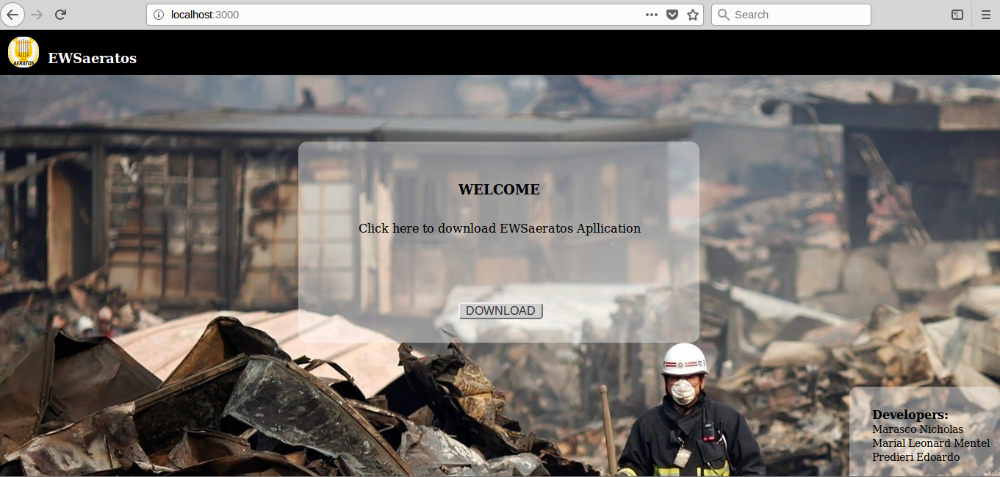
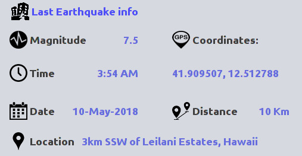
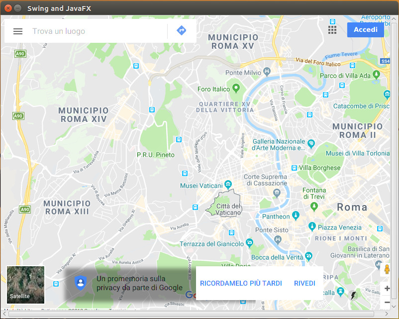

# EWSaeratos

**EWSaeratos** is an application aimed at guaranteeing the safety of people in the event of an earthquake.
It also provides useful informations about the latest records of global and local earthquakes.

## SERVER

To open the server, type: 

```
$ bundle install  
$ rake db:migrate  
$ rails start
```
Open your browser and go to "http://localhost:3000/ and follow the instruction to download the Client




### Privacy 
Your Privacy is garanteed by the integration of *Google Oauth* protocol.
On startup of Rails server is created a logger with this function:

```Ruby
OmniAuth.config.logger = Rails.logger

#Google client id = 543824881127-hilli6393c0dvcb66en2s1695l1i9t8p.apps.googleusercontent.com
#Google client secret = DmBRdM2XryjfoGqZpa48ytCa

#Oauth middleware
Rails.application.config.middleware.use OmniAuth::Builder do
  provider :google_oauth2, '543824881127-hilli6393c0dvcb66en2s1695l1i9t8p.apps.googleusercontent.com', 'DmBRdM2XryjfoGqZpa48ytCa',      access_type: 'online', prompt: ''
end
```
This logger allows you to save the Current-User in a database (sqlite) with this form:

```Ruby
class User < ActiveRecord::Base
  def self.from_omniauth(auth)
    where(provider: auth.provider, uid: auth.uid).first_or_initialize.tap do |user|
      user.provider = auth.provider
      user.uid = auth.uid
      user.name = auth.info.name
      user.typeU = '0'                                                  #this is type camp: 1=stardard 2=premium User
      user.oauth_token = auth.credentials.token
      user.oauth_expires_at = Time.at(auth.credentials.expires_at)
      user.save!
    end
  end
end
```

### Quake Fuctions ###
The report of latest earthquake is showed in this way:



And you can see the location in the pop-up map:



These informations are given using the API from: https://earthquake.usgs.gov/fdsnws/event/1/
by yhe controller:

```Ruby
class QuakeController < ApplicationController

    require 'open-uri'
    require 'json'

    def get

        limitValue=params[:limit]
        password = params[:passw]

        if password == "ectrodattiliadisplasiaectodermicalabiopalatoschisi"     #complete password

            url="https://earthquake.usgs.gov/fdsnws/event/1/query?format=geojson&eventtype=earthquake&orderby=time&limit=" + limitValue.to_s    #USGS api
            prova= open(url, &:read)

            data = JSON.parse(prova)
            features = data["features"]

            retArr = Array.new(limitValue.to_i-1)

            for i in 1..limitValue.to_i
                earthquake =features[i-1]
                properties = earthquake["properties"]
                geometry = earthquake["geometry"]
                coordinates = geometry["coordinates"]

                id = earthquake["id"];
                magnetude= properties["mag"]
                place= properties["place"]
                time=properties["time"].to_i

                timeEpo = Time.at(time /1000).to_s

                formattedTime=timeEpo.split(" ")[0] +" "+ timeEpo.split(" ")[1] ;

                ret ={"id"=> id.to_s, "magn" => magnetude.to_s, "place" => place.to_s, "time" => formattedTime.to_s, "coord" => coordinates }
                retArr[i-1]=ret
            end

            render json: {"elem" => retArr}

        else
            render json: {"status" => "error"}
        end
    end

end
```
### Security###
The EWSaeratos securety is garanteed by the sum of two differents passwords: one insert by default in the client and the other passed by the Rails server when login is succesful.

With this method we solve two problems: an User who want take informations without usig the client and an User who want using the application without logged in.

The Rails server gives the first part of password with this function:

```Ruby
class StatusController < ApplicationController
    def index
	passw="ectrodattiliadisplasiaectodermica"                           #First part of password
        if current_user                                                 #If User is logged I can send to Client the first part of password
            userType=params[:type]
            current_user.typeU = userType
            current_user.save!
            ret ={"status" => "logged", "type" => userType.to_s, "pass" => passw.to_s}
            render json: ret
        else
            ret ={"status" => "unlogged"}
            render json: ret
        end
    end
end
```
